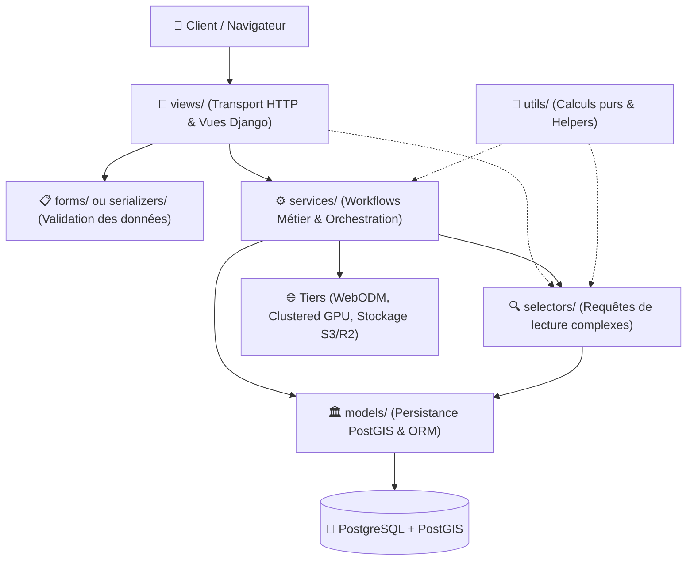

# Règle d'Agent — Conventions de Nommage & Architecture Backend Découplée

> **Norme d'Ingénierie & Signature Architecturale du Projet**  
> Ce document formalise l'adaptation pour **Django / GeoDjango** de la convention de nommage et de la séparation des responsabilités issues de l'ingénierie GeenkoDev. Il s'applique à toute refonte ou tout développement au sein du dossier `app/apps/`.

---

## 🏛️ 1. La Convention des Préfixes Auto-Descriptifs (`<couche>_<domaine>.py`)

Dans une application Django modulaire, les dossiers internes ne doivent plus contenir de fichiers portant des noms génériques ambigus (`views.py`, `forms.py`, `models.py` monolithiques ou sous-fichiers sans préfixe).

Chaque fichier doit obligatoirement porter un préfixe explicitant sa couche :

```text
app/apps/<nom_app>/
├── models/         ➔  models_user.py,       models_role.py,       models_cadastre.py
├── forms/          ➔  forms_user.py,        forms_admin.py,       forms_cadastre.py
├── serializers/    ➔  serializers_user.py,  serializers_cadastre.py  (si API REST)
├── services/       ➔  services_drone.py,    services_export.py,   services_sync.py
├── selectors/      ➔  selectors_foncier.py, selectors_user.py     (requêtes de lecture)
├── views/          ➔  views_auth.py,        views_management.py,  views_profile.py
└── utils/          ➔  utils_geo.py,         utils_export.py
```

### 🎯 Les 3 Bénéfices Immédiats :
1. **Élimination de la confusion d'onglets (Anti-Tab Confusion)** :
   - Travailler sur le domaine `user` ouvre `models_user.py`, `forms_user.py` et `views_management.py`. Finis les 5 onglets identiques intitulés `views.py` ou `forms.py`.
2. **Recherche Globale Instantanée (`Ctrl + P`)** :
   - Taper `forms_user` ou `services_dro` ouvre directement le fichier exact sans ambiguïté de chemin.
3. **Clarté Absolue des Imports & Zéro Collision** :
   ```python
   # Imports clairs, lisibles et sans alias lourds
   from accounts.models.models_user import CustomUser
   from accounts.forms.forms_user import StandardUserForm
   from accounts.services.services_rbac import delegate_permissions
   ```

---

## 🧱 2. Matrice de Séparation des Responsabilités (Adaptation Django)

L'architecture découpe le flux applicatif en couches étanches :



---

## 🔍 3. Rôle par Rôle : Ce qui est Recommandé vs Strictement Proscrit

### 🏛️ 1. `models/` — Persistance & Intégrité Relationnelle
* **Rôle** : Définition pure des tables PostgreSQL, des champs géométriques PostGIS et des contraintes.
* **Autorisé** :
  - Champs, clés primaires/étrangères, index spatiaux (`GistIndex`), cascades.
  - Calculs atomiques dans `save()` (ex: surface automatique en projection métrique).
  - Propriétés simples dérivées d'attributs de l'instance (`@property`).
* **STRICTEMENT PROSCRIT** :
  - ❌ Aucune logique de vue, aucun import de `request`, de templates ou de sessions.
  - ❌ Pas d'appels réseau, pas d'envoi d'e-mails ou de déclenchements de tâches lourdes.

### 📋 2. `forms/` et `serializers/` — Contrat, Validation & Nettoyage
* **Rôle** : Validation rigoureuse des entrées utilisateurs (POST/PUT/PATCH).
* **Autorisé** :
  - Définition des champs de formulaire (`forms.CharField`, widgets Crispy/Bootstrap).
  - Validation personnalisée dans `clean_<champ>()` ou `clean()`.
  - Normalisation des données et renvoi d'erreurs conviviales (`ValidationError`).
* **STRICTEMENT PROSCRIT** :
  - ❌ Pas d'orchestration métier lourde (ex: appeler l'API WebODM ou envoyer un SMS dans `form.save()`).
  - ❌ Pas de dépendance directe aux spécificités de déploiement.

### ⚙️ 3. `services/` — Cerveau Métier & Orchestration Multi-Domaines
* **Rôle** : Exécution des cas d'usage complets nécessitant coordination ou logique complexe.
* **Autorisé** :
  - Fonctions pures orchestrant plusieurs opérations atomiques :
    - `services_rbac.py` : assigner, révoquer ou plafonner les permissions d'un compte.
    - `services_drone.py` : lancer le traitement photogrammétrique, générer les tuiles XYZ.
    - `services_cadastre.py` : scission de parcelle, calculs d'empiètement géométrique.
  - Gestion des transactions atomiques (`with transaction.atomic():`).
* **STRICTEMENT PROSCRIT** :
  - ❌ Découplage complet de l'objet `request` : un service reçoit des arguments explicites (IDs, instances, dictionnaires typés) et jamais l'objet `request` de Django.
  - ❌ Ne retourne jamais de `HttpResponse`, `render()` ou `redirect()`.

### 🔍 4. `selectors/` — Lecture, Requêtage & Filtres Réutilisables
* **Rôle** : Centraliser les requêtes ORM de consultation pour éviter la duplication des `filter()` / `select_related()` dans les vues.
* **Autorisé** :
  - Fonctions de requêtage pures : `get_active_users_for_admin(admin_user)`, `list_cadastre_for_territory(territory)`.
  - Optimisations ORM (`select_related`, `prefetch_related`, `only`, `defer`).
* **STRICTEMENT PROSCRIT** :
  - ❌ Zéro mutation de données (`.create()`, `.update()`, `.delete()`). Un sélecteur ne fait que lire.

### 🚪 5. `views/` — Couche Présentation & Transport
* **Rôle** : Traiter la requête HTTP, vérifier l'habilitation, appeler le service/sélecteur, et renvoyer la réponse (`render` ou JSON).
* **Autorisé** :
  - Vérification de permissions (via décorateurs ou `has_perm`).
  - Instanciation des formulaires avec `request.POST`.
  - Transmission des données validées aux services.
  - Gestion des messages utilisateurs (`messages.success`, `messages.error`).
* **STRICTEMENT PROSCRIT** :
  - ❌ Pas de requêtes SQL brutes ou de filtres ORM complexes en ligne (déléguer aux sélecteurs).
  - ❌ Pas de calculs géométriques ou de logique métier dense (déléguer aux services).

---

## 📋 4. Checklist d'Évolution d'un Domaine Métier Django

Lors de la création ou restructuration d'un domaine :
1. [ ] **Modèle** : Déclarer dans `models/models_<domaine>.py`.
2. [ ] **Formulaire** : Créer `forms/forms_<domaine>.py`.
3. [ ] **Sélecteur** : Si requêtes spécifiques, déclarer dans `selectors/selectors_<domaine>.py`.
4. [ ] **Service** : Si logique métier multi-étapes, implémenter dans `services/services_<domaine>.py`.
5. [ ] **Vues** : Implémenter dans `views/views_<domaine>.py` en restant ultra-concis.
6. [ ] **URLs** : Raccorder dans `urls.py`.
