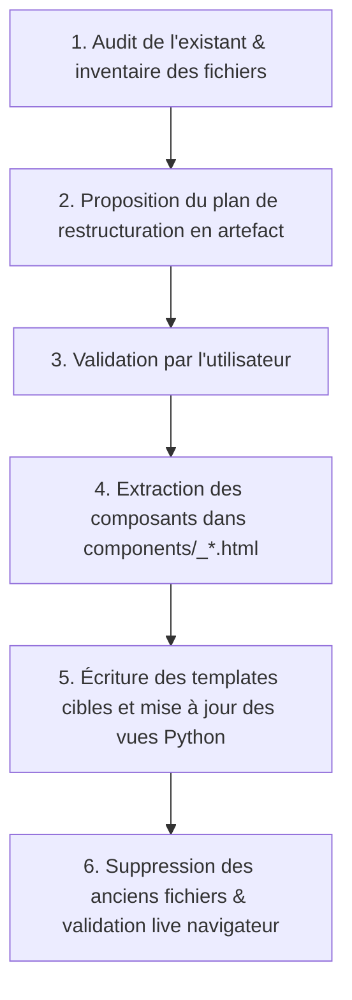

# Règle d'Agent — Modèle Standard de Restructuration Frontend & Templates

> **Obligation stricte pour tout agent ou développeur intervenant sur l'interface utilisateur de GéoFoncier.**  
> Ce document définit le modèle éprouvé sur `accounts/`, `static/css/` et `static/js/`, qui doit être appliqué et propagé à l'identique sur tous les autres dossiers de templates du projet (`foncier`, `commune`, `dashboard`, `drones`, `navigation`, `pdu`, `constructions`).

---

## 1. Principes Directeurs Inviolables

1. **Préservation absolue du design actuel (Zéro régression visuelle) :**
   - La restructuration est strictement architecturale.
   - On ne modifie pas les palettes de couleurs, les polices, les marges, les animations existantes ni l'expérience utilisateur sans accord explicite préalable.
2. **Intégrité fonctionnelle et des URLs :**
   - Les noms de routes Django (`name='login'`, `name='espace_detail'`, etc.) ne doivent **jamais** changer.
   - Les formulaires (IDs des inputs, jetons CSRF, attributs `data-*`, validation Django / Crispy) doivent rester 100% fonctionnels.
3. **Élimination totale des "fichiers plats en vrac" :**
   - Tout dossier de templates contenant plus de 4 ou 5 fichiers plats doit être découpé en sous-dossiers fonctionnels étanches avec un dossier `components/` dédié.

---

## 2. Le Modèle de Découpage des Templates (Pattern `accounts/`)

Chaque application doit organiser ses templates en **sous-domaines métiers** et **composants partagés**.

### Anatomie du modèle de référence :
```text
templates/<nom_app>/
├── 📁 <sous_domaine_1>/           # Ex: auth/ pour accounts, ou espaces/ pour foncier
│   ├── page_principale.html       # Vue principale du flux
│   ├── action_secondaire.html     # Autre vue du même flux
│   └── 📁 components/             # 🧩 Composants réutilisables spécifiques
│       ├── _header_section.html   # Partials avec préfixe tiret bas
│       └── _kpi_cards.html
│
├── 📁 <sous_domaine_2>/           # Ex: management/ pour accounts, ou batiments/ pour foncier
│   ├── list.html                  # Table / Liste avec pagination
│   ├── form.html                  # Formulaire création / édition unifié
│   ├── confirm_delete.html        # Boîte de confirmation de suppression
│   └── 📁 components/
│       └── _table_row.html
│
└── 📁 components/                 # 🧩 Composants transversaux partagés par toute l'app
    ├── _actions_bar.html
    └── _modal_generic.html
```

### Conventions de nommage des templates :
- **Composants partagés (`include`) :** Toujours préfixés par un tiret bas `_` (ex: `_left_panel.html`, `_filters_bar.html`).
- **Pages autonomes (`extends 'base.html'`) :** Noms clairs et standardisés sans tiret bas (`list.html`, `form.html`, `detail.html`, `confirm_delete.html`).
- **Passage de contexte :** Privilégier les composants paramétrables via `` pour éviter la duplication.

---

## 3. Le Modèle de Modularisation CSS (`app/static/css/`)

Il est formellement interdit de concevoir des méga-fichiers CSS ou de stocker de volumineux blocs `<style>` (> 20 lignes) directement dans les templates HTML.

### Architecture modulaire orchestrée :
Le point d'entrée unique [geofoncier.css](file:///f:/Coding/partenariat/ngom-ngom/geo_fancier_copy/app/static/css/geofoncier.css) rassemble l'ensemble des modules via `@import` :

```css
/* static/css/geofoncier.css */
@import url('global.css');      /* 1. Variables :root, resets, typographie, layout global */
@import url('components.css');  /* 2. Composants UI (cards, KPI, badges, tables, pills) */
@import url('forms.css');       /* 3. Inputs, selects, validation, boutons d'action */
@import url('map.css');         /* 4. Cartographie Leaflet, légendes, volets latéraux */
@import url('auth.css');        /* 5. Flux d'authentification, animations, tickers */
@import url('drones.css');      /* 6. Missions drones, orthophotos, indicateurs de vol */
```

### Règle d'extension :
- Si un nouveau module métier nécessite des styles spécifiques récurrents (ex: `cadastre.css` ou `navigation.css`), créer un fichier dédié dans `static/css/<nom>.css` et l'importer dans `geofoncier.css`.
- Ne jamais ajouter de style global hors de `global.css` ou `components.css`.

---

## 4. Le Modèle de Modularisation JavaScript (`app/static/js/`)

Le code JavaScript doit être découpé par **responsabilité technique** et orchestré sous un point d'entrée unique [geofoncier.js](file:///f:/Coding/partenariat/ngom-ngom/geo_fancier_copy/app/static/js/geofoncier.js).

### Architecture modulaire orchestrée :
```javascript
// static/js/geofoncier.js
import './global.js';    // Helpers utilitaires, CSRF, tooltips Bootstrap, toasts
import './map.js';       // Fabrique et instances de cartes Leaflet, fonds de plan
import './layers.js';    // Couches vectorielles GeoJSON, styles dynamiques, popups
import './search.js';    // Barre de recherche textuelle et géographique
import './charts.js';    // Graphiques interactifs Chart.js (dashboard, stats)
```

### Règles strictes d'écriture JS :
1. **Isolation des scopes :** Utiliser des IIFE `(function() { ... })();` ou des modules ES pour ne pas polluer l'objet `window`.
2. **Conservation des signatures :** Les fonctions appelées par les templates existants (ex: `initMap()`, `toggleLayer()`, etc.) doivent conserver scrupuleusement leur nom et leurs paramètres.
3. **Zéro script lourd inliné :** Les scripts dans les templates `<script>` doivent se limiter à l'injection de données serveur Django (`JSON.parse(...)`) ou à l'appel d'une fonction définie dans les modules statiques.

---

## 5. Procédure Étape par Étape pour Propager le Modèle

Lorsqu'un agent entreprend de restructurer un autre dossier de templates (ex: `templates/foncier/` ou `templates/commune/`), il doit suivre **obligatoirement** ce protocole en 6 étapes :



### Détail des étapes :

1. **Audit :** Analyser le nombre de fichiers, les duplications évidentes (en-têtes de page, tables, modales) et les blocs de styles inlinés.
2. **Plan & Validation :** Présenter à l'utilisateur l'arborescence cible (`sous_dossiers/` et `components/`) avant toute action.
3. **Extraction des composants :** Isoler d'abord les morceaux répétés dans `components/_nom.html`.
4. **Création des templates structurés :** Créer les fichiers modulaires en réutilisant les composants via ``.
5. **Mise à jour synchronisée Python :** Modifier dans [app/apps/<nom_app>/views/](file:///f:/Coding/partenariat/ngom-ngom/geo_fancier_copy/app/apps) les appels `render(request, '<app>/<sous_dossier>/<fichier>.html')`.
6. **Nettoyage & Test :** Supprimer les anciens fichiers plats orphelins et vérifier que la page se charge sans erreur `TemplateDoesNotExist`.
