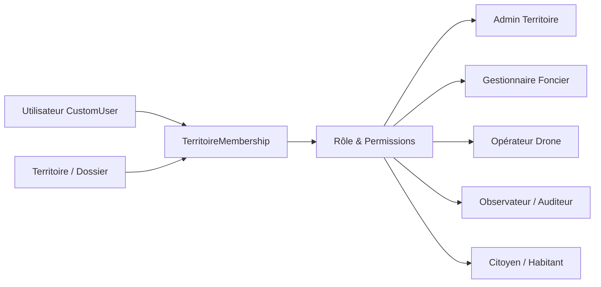

# 🌐 Vision Long Terme & Principes Directeurs : GéoFoncier

> **Directive d'Architecture Fondamentale** : Ce document définit la boussole stratégique et technique du projet. Il s'applique à tout agent IA et à tout contributeur développant sur le projet **GéoFoncier**.

---

## 🏛️ 1. La Boussole Stratégique : Le Modèle Open-Core

Le projet n'a pas vocation à rester un outil interne restreint aux deux lieux initiaux (Campus UAD et Commune de Ngogom). Il est conçu pour devenir une **plateforme universelle de gestion foncière et cartographique par drone**.

Le modèle économique et de distribution adopté est le standard **Open-Core** (à l'instar d'acteurs de référence tels que **Netdata**, **Chatwoot**, **Stalwart Mail**, ou **Supabase**) :

```text
┌────────────────────────────────────────────────────────────────────────┐
│                        ÉDITION ENTERPRISE / CLOUD                      │
│   • Multi-tenant managé (SaaS Cloud prêt à l'emploi)                   │
│   • RBAC granulaire par Organisation & Territoire (Permissions fines)  │
│   • Authentification SSO / SAML / OIDC & Audit logs de conformité      │
│   • Stockage d'orthophotos managé (S3 / Cloudflare R2 / MinIO)         │
│   • Traitement WebODM distribué en cluster GPU managé                  │
│   • Support SLA, quotas, métriques avancées & alertes temps réel       │
└───────────────────────────────────┬────────────────────────────────────┘
                                    │ repose sur
┌───────────────────────────────────▼────────────────────────────────────┐
│                  ÉDITION COMMUNAUTAIRE (OPEN-SOURCE)                   │
│   • Image Docker communautaire officielle auto-hébergeable             │
│   • Cœur SIG complet : GeoDjango, PostGIS, Leaflet                     │
│   • Modèle de dossiers multi-territoires de base                       │
│   • Gestion foncière : bâtiments, voiries, espaces, cadastre           │
│   • Chaîne photogrammétrique locale : WebODM local, tuiles XYZ         │
│   • Signalements citoyens géolocalisés de base                         │
└────────────────────────────────────────────────────────────────────────┘
```

---

## 📁 2. L'Architecture « Un Lieu = Un Dossier » (Multi-Territoires Universel)

Chaque nouveau lieu à cartographier et à gérer est représenté comme une **entité indépendante (un "dossier" ou workspace territorial)**. 

### Règle d'or absolue :
> **Interdiction formelle de créer une nouvelle application Django par nouveau lieu.**
> Tout lieu (université, commune rurale, métropole, zone industrielle, parcelle agricole) est une **instance** de données rattachée à un `Territoire` dynamique, et non du code durci.

### Principes techniques du système de dossier :
1. **Unicité des fonctionnalités pour chaque dossier** :
   Chaque territoire hérite dynamiquement de toutes les capacités de la plateforme :
   * Inventaire foncier (bâtiments, voiries, parcelles, réserves, espaces verts).
   * Aide à la décision pour les futures implantations & constructions.
   * Cadastre et suivi d'occupation du bâti (habité / non habité).
   * Chaîne photogrammétrique par drone (missions, orthophotos GeoTIFF, tuiles XYZ).
   * Cartographie interactive Leaflet personnalisée.
   * Module de signalement citoyen géolocalisé avec circuit de traitement.
2. **Configuration déclarative du territoire** :
   Chaque dossier dispose de son identité, de sa bounding box, de son centre et zoom cartographique par défaut, et de son système de projection métrique local (**EPSG:32628**, **EPSG:32629**, etc.).
3. **Zéro couplage en dur** :
   Aucun nom, coordonnées GPS, taux d'occupation ou préfixe de code ne doit être figé dans le code Python ou les templates. Tout provient du contexte du territoire actif.

---

## 👥 3. Gestion des Utilisateurs & Système de Permissions Granulaires (RBAC)

Pour accueillir un écosystème multi-acteurs (élus, géomaticiens, urbanistes, citoyens, auditeurs), le système de permissions évolue d'un rôle statique unique vers un **contrôle d'accès basé sur les rôles scopé par territoire (Scoped RBAC)**.



### Règles de conception :
1. **Scopes de permissions** :
   Un utilisateur peut être :
   * **Administrateur** sur le territoire de la *Commune de Ngogom*.
   * **Simple observateur / visiteur** sur le territoire du *Campus UAD*.
   * **Super-administrateur** global sur l'ensemble de l'instance.
2. **Propriétés & Décorateurs** :
   Tout contrôle de droit applicatif doit vérifier le droit vis-à-vis du territoire actif :
   * `user.has_territory_perm(territory, 'can_edit_cadastre')`
   * Décorateurs : `@require_territory_perm('can_manage_drones')`
3. **Auto-inscription et rôles publics** :
   L'inscription libre publique assigne par défaut le profil invité/citoyen sur le territoire rattaché, sans aucun droit d'altération administrative.

---

## 🛡️ 4. Invariants pour les Développements Futurs (Checklist Agent)

Pour toute tâche, refactorisation ou ajout de fonctionnalité, l'agent doit valider les points suivants :

- [ ] **Agnosticisme du lieu** : La fonctionnalité fonctionne-t-elle pour n'importe quel territoire ? Dépend-elle d'un `territory_id` ou d'un contexte actif ?
- [ ] **Respect du modèle Open-Core** : Le socle développé reste-t-il pleinement fonctionnel dans l'image Docker communautaire sans verrouillage propriétaire ?
- [ ] **Permissions vérifiées** : Les autorisations sont-elles vérifiées au niveau territorial et non par un test simpliste `user.role == 'admin'` ?
- [ ] **Projection dynamique** : Les calculs de surface métrique utilisent-ils la projection configurée du territoire (`territory.srid_metrique`) et non la constante `32628` en dur ?
- [ ] **Documentation synchronisée** : Tout changement de paradigme ou extension d'architecture est reporté dans le dossier `docs/`.