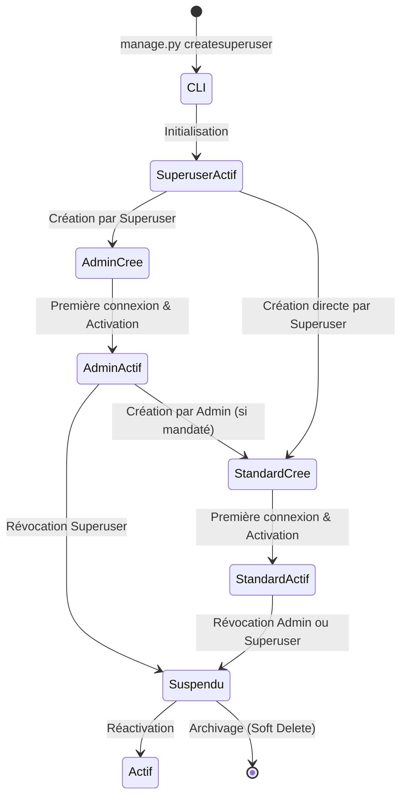

# Gouvernance Institutionnelle des Comptes & Modèle RBAC

Ce document définit l'architecture fonctionnelle et technique du système d'authentification, de gestion des utilisateurs et de délégation des permissions de la plateforme **GéoFoncier**.

---

## 1. Contexte & Enjeux de Gouvernance

GéoFoncier est un progiciel métier destiné aux entités publiques et régaliennes :
- **Directions Générales du Cadastre et de la Conservation Foncière**
- **Ministères de tutelle (Urbanisme, Aménagement du Territoire, Finances)**
- **Rectorats universitaires et Établissements publics d'enseignement supérieur**
- **Collectivités territoriales et Communes**

Contrairement à une application Web grand public, la sensibilité des données cadastrales, des délimitations parcellaires et des titres d'occupation impose une **fermeture stricte de l'auto-inscription** et une **traçabilité intégrale des habilitations**.

---

## 2. Typologie des Comptes : Le Modèle Pyramidal à 3 Niveaux

Le système d'acteurs est articulé autour de 3 échelons strictement hiérarchisés :

```text
                     ▲
                    / \
                   /   \
                  / SUP \         Niveau 1 : Superuser (Maître d'instance unique)
                 /───────\
                /  ADMIN  \       Niveau 2 : Administrateurs Délégués
               /───────────\
              /  STANDARD   \     Niveau 3 : Comptes Métier & Opérateurs
             /───────────────\
```

### 2.1. Niveau 1 : Le Superuser (Instance Owner)
* **Cardinalité :** Unique au sein de l'instance opérationnelle.
* **Mode de création :** Exclusivement en ligne de commande via l'invite système :
  ```bash
  python app/manage.py createsuperuser
  ```
* **Responsabilités :**
  - Maîtrise absolue de la configuration de l'instance et des paramètres de sécurité.
  - Création, suspension et révocation des comptes de Niveau 2 (**Admins**).
  - Définition du catalogue global des permissions du système.
  - Définition et bridage des plafonds d'autorité conférés à chaque Admin.

### 2.2. Niveau 2 : Les Administrateurs Délégués (Admins)
* **Profils types :** Directeurs de service foncier, Conservateurs fonciers, Secrétaires Généraux de mairie, Chefs de département SIG.
* **Mode de création :** Créés et configurés exclusivement par le **Superuser**.
* **Responsabilités :**
  - Gestion opérationnelle quotidienne d'un périmètre ou service déterminé.
  - Création et affectation des comptes de Niveau 3 (**Standard**).
  - Attribution de permissions aux comptes Standard **exclusivement dans le sous-ensemble de droits qui leur a été délégué par le Superuser**.
* **Invariants stricts :**
  - Un Admin ne peut pas créer d'autre compte Admin.
  - Un Admin ne peut pas modifier ses propres permissions ni s'auto-attribuer des privilèges supérieurs.
  - Si le Superuser révoque l'autorisation de créer des comptes pour un Admin, toute tentative d'ajout par cet Admin est immédiatement bloquée.

### 2.3. Niveau 3 : Les Comptes Standard (Opérateurs Métier)
* **Profils types :** Géomètres, télépilotes de drones, instructeurs de dossiers, techniciens cartographes, agents recenseurs.
* **Mode de création :** Créés par le **Superuser** ou par un **Admin** mandaté à cet effet.
* **Principe du Moindre Privilège :**
  - Zéro accès aux modules d'administration système et à l'annuaire global des utilisateurs.
  - Accès restreint aux seuls modules, formulaires et territoires qui leur sont explicitement délégués.

---

## 3. Matrice de Délégation Descendante

La gouvernance des habilitations suit une chaîne de causalité descendante unidirectionnelle :

| Action / Fonctionnalité | Superuser | Admin Délégué | Compte Standard |
| :--- | :---: | :---: | :---: |
| **Initialisation premier compte (CLI)** | ✅ Exclusif | ❌ | ❌ |
| **Définir la liste globale des permissions** | ✅ Exclusif | ❌ | ❌ |
| **Plafonner les pouvoirs des Admins** | ✅ Exclusif | ❌ | ❌ |
| **Créer / Modifier un compte Admin** | ✅ | ❌ | ❌ |
| **Créer un compte Standard** | ✅ | ✅ *(si autorisé par Superuser)* | ❌ |
| **Modifier les droits d'un compte Standard** | ✅ | ✅ *(dans la limite de son enveloppe)* | ❌ |
| **Désactiver un compte Standard** | ✅ | ✅ *(si gestionnaire du compte)* | ❌ |
| **Supprimer / Désactiver un compte Admin** | ✅ | ❌ | ❌ |
| **Consulter le journal d'activité (Audit Log)** | ✅ Global | ✅ *(périmètre propre)* | ❌ |

---

## 4. Cycle de Vie des Utilisateurs



1. **Amorçage (Provisioning initial) :**
   - Le Superuser initialise la plateforme au déploiement via Docker ou CLI.
2. **Création interne (Pas d'auto-inscription) :**
   - L'écran public `/accounts/login/` n'offre aucun lien vers un formulaire d'enregistrement.
   - L'enregistrement se fait par formulaire d'invitation/création d'agent dans l'espace d'administration interne.
3. **Conservation des traces & Soft Delete :**
   - Afin de préserver la validité juridique de l'historique foncier et cadastral, la suppression physique (`user.delete()`) est proscrite en production.
   - Les départs ou révocations sont traités par désactivation logique (`is_active = False`), conservant toutes les relations associées dans l'`ActivityLog`.

---

## 5. Garde-fous Techniques de Sécurité

1. **Anti-Privilege Escalation :**
   - Les formulaires d'édition de compte exposés aux Admins n'affichent jamais le champ rôle permettant la sélection de `Admin` ou `Superuser`.
2. **Cloisonnement des vues d'administration :**
   - Les décorateurs applicatifs et vérifications de requêtes valident la légitimité de l'acteur vis-à-vis de l'utilisateur ciblé (`request.user.can_manage(target_user)`).
3. **Imperméabilité des permissions déléguées :**
   - Tout formulaire d'attribution de droits vérifie côté serveur (`clean()`) que l'ensemble des permissions octroyées est un sous-ensemble strict des permissions détenues par l'Admin appelant.
