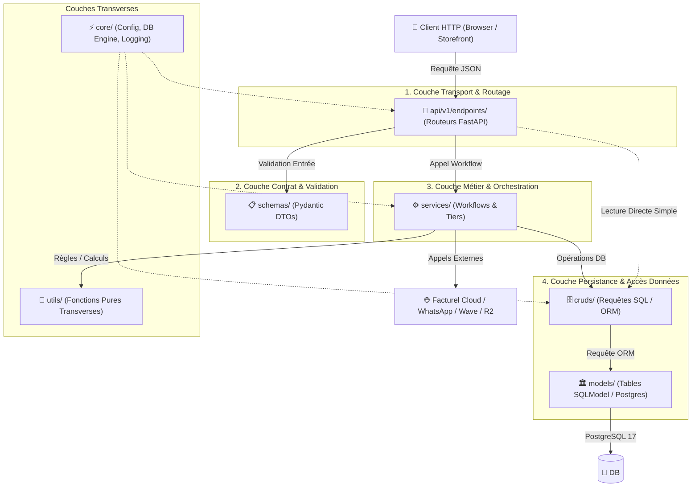

# 🏛️ Guide d'Architecture & Conventions de Nommage Backend (FastAPI / GeenkoDev)

> [!IMPORTANT]
> **Norme d'Ingénierie & Signature Architecturale GeenkoDev** : Ce document explicite la philosophie de conception, le système de nommage préfixé (`<couche>_<domaine>.py`) et la séparation rigoureuse des responsabilités appliqués dans le backend `apps/api` de **Kabowd Admin** et généralisables à tout projet Python / FastAPI de l'écosystème.

---

## 1. Philosophie & Origine de la Convention de Nommage

Dans beaucoup de projets standards, les fichiers portent le même nom dans chaque dossier (`models/catalog.py`, `schemas/catalog.py`, `crud/catalog.py`). Cette approche génère une friction quotidienne majeure.

Notre architecture applique la règle des **Préfixes Auto-Descriptifs (`<dossier>_<domaine>.py`)** :

```text
apps/api/
├── models/      ➔  models_catalog.py,  models_tenant.py,  models_order.py
├── schemas/     ➔  schemas_catalog.py, schemas_tenant.py, schemas_order.py
├── cruds/       ➔  cruds_catalog.py,   cruds_tenant.py,   cruds_order.py
├── services/    ➔  services_sync.py,   services_gowa.py,  services_wave.py
├── utils/       ➔  utils_email.py,     utils_feeds.py,    utils_tenants.py
└── core/        ➔  core_config.py,     core_database.py
```

### 🎯 Les 3 Bénéfices Techniques Majeurs :

1. **Élimination Totale de la Confusion d'Onglets ("Anti-Tab Confusion")** :
   - Dans VS Code ou n'importe quel IDE, ouvrir 5 fichiers n'affiche pas cinq onglets étiquetés `catalog.py`.
   - Les onglets affichent explicitement : `models_catalog.py`, `schemas_catalog.py`, `cruds_catalog.py`. En un clin d'œil, le développeur sait exactement dans quelle couche il travaille.
2. **Recherche Globale Instantanée (Fuzzy Search / `Ctrl + P`)** :
   - Taper `models_cat` ou `cruds_ord` ouvre directement le bon fichier au premier résultat, sans devoir filtrer manuellement le chemin du répertoire dans la liste des résultats.
3. **Clarté Absolue des Imports & Zéro Collision de Noms** :
   - Les instructions d'importation sont immédiatement explicites et auto-documentées :
     ```python
     from models.models_catalog import Item, Category
     from schemas.schemas_catalog import ItemCreate, ItemRead
     from cruds.cruds_catalog import get_item_by_id, list_items
     ```
   - Plus besoin de créer des alias lourds (`import models.catalog as catalog_models`), et les traces de débogage (stacktraces GlitchTip / Sentry) identifient la couche fautive dès le nom du fichier.

---

## 2. Matrice de Séparation des Responsabilités (Separation of Concerns)

L'architecture découpe le flux applicatif en **6 couches étanches**, chacune ayant une responsabilité unique et stricte :



---

## 3. Détail Rôle par Rôle : Ce qui y va vs Ce qui est interdit

### 🏛️ `models/` — Persistance & Structure Relationnelle
- **Rôle** : Représentation fidèle des tables PostgreSQL en base de données.
- **Technologies** : `SQLModel`, `SQLAlchemy 2.0`, colonnes `JSONB`.
- **Ce qui y figure** :
  - Définition des champs, types de colonnes, clés primaires UUID, clés étrangères.
  - Relations bidirectionnelles (`Relationship`), cascades, indexes composés (ex: `Index("ix_items_tenant_slug", ...)`).
  - Propriétés dérivées simples (`@property`).
- **Ce qui y est STRICTEMENT PROSCRIT** :
  - Aucune requête réseau ni logique métier complexe.
  - Aucun import de `FastAPI`, `Request`, `Response`, ni de `HTTPException`.

---

### 📋 `schemas/` — Validation & Contrats d'Interface
- **Rôle** : Définition des structures de données échangées via HTTP (DTO : Data Transfer Objects).
- **Technologies** : `Pydantic v2` (`BaseModel`, `Field`, `validator`, `ConfigDict`).
- **Nomenclature type** :
  - `<Entité>Base` : Attributs partagés.
  - `<Entité>Create` : Payload requis à la création (POST).
  - `<Entité>Update` : Payload optionnel pour les mises à jour partielles (PATCH).
  - `<Entité>Read` / `<Entité>Detail` : Structure renvoyée au client (GET) incluant IDs, dates, relations sérialisées.
- **Ce qui y figure** :
  - Règles de validation fine (regex, longueurs minimales, formats email, coercition de types).
- **Ce qui y est STRICTEMENT PROSCRIT** :
  - Aucun appel base de données (`Session`, `select`, `commit`).
  - Aucun import des modèles SQLModel orientés tables (`table=True`).

---

### 🗄️ `cruds/` — Accès aux Données & Opérations ORM Atomiques
- **Rôle** : Encapsuler et standardiser toutes les opérations de lecture et écriture SQL.
- **Technologies** : `SQLModel.Session`, `sqlalchemy.select`, `update`, `delete`.
- **Ce qui y figure** :
  - Fonctions pures recevant `db: Session` en premier argument :
    `get_item(db, item_id, tenant_id)`, `list_items(db, skip, limit, filters)`, `create_item(db, item_in, tenant_id)`.
  - Pagination, tri SQL, clauses `where`, jointures relationnelles (`selectinload`).
  - Maintien de l'isolation multi-tenant (filtrage systématique sur `tenant_id`).
- **Ce qui y est STRICTEMENT PROSCRIT** :
  - Ne lève pas de `HTTPException` (retourne `None` ou des exceptions Python pures).
  - Aucun appel d'API externe (pas d'envoi de mail, pas de webhook, pas de WhatsApp).

---

### ⚙️ `services/` — Logique Métier & Orchestration Multi-Systèmes
- **Rôle** : Cerveau applicatif qui pilote les cas d'usage complets.
- **Ce qui y figure** :
  - Orchestration de flux impliquant plusieurs CRUDs (ex: créer une commande + décrémenter le stock + enregistrer l'historique).
  - Interconnexion avec des services tiers et le **Projet Fusion** :
    - `services_sync.py` : Moteur de synchronisation de catalogue avec `facturel-soft-online-api`.
    - `services_gowa.py` : Formatage et expédition des notifications WhatsApp.
    - `services_wave.py` : Génération des sessions de paiement et validation HMAC des webhooks Wave.
    - `services_catalog_feeds.py` : Génération des flux marchands (Google Shopping, Facebook Catalog).
- **Ce qui y est STRICTEMENT PROSCRIT** :
  - Pas de requêtes SQL brutes si une fonction CRUD existe déjà.
  - Découplage de la couche transport (ne manipule pas l'objet `Request` directement).

---

### 🧰 `utils/` — Utilitaires Transverses & Fonctions Pures
- **Rôle** : Fonctions d'aide génériques sans dépendance au domaine métier direct.
- **Ce qui y figure** :
  - `utils_email.py` : Moteur de rendu de templates Jinja2 et envoi SMTP.
  - `utils_feeds.py` : Échappement et construction de structures XML/RSS.
  - `utils_tenants.py` : Helpers de résolution de sous-domaines ou slugs.
- **Ce qui y est STRICTEMENT PROSCRIT** :
  - Ne dépend d'aucun modèle spécifique de `models/`. Doit rester agnostique.

---

### ⚡ `core/` — Infrastructure & Socle Système
- **Rôle** : Fondations techniques indispensables au démarrage et à la vie de l'application.
- **Fichiers normalisés** :
  - `core_config.py` : Classe `Settings` (pydantic-settings) centralisant toutes les variables d'environnement (.env).
  - `core_database.py` : Moteur PostgreSQL (`create_engine`), session factory (`sessionmaker`) et générateur `get_session`.
  - `logging_config.py` : Configuration de la journalisation structurée JSON.

---

## 4. Exemple Concret de Synergie : Le Domaine "Catalog"

Voici comment les 4 fichiers du domaine `catalog` interagissent harmonieusement :

```text
1. Requête HTTP reçue :
   POST /api/v1/catalog/items
   Payload validé par : schemas/schemas_catalog.py (ItemCreate)

2. Routeur (api/v1/endpoints/admin/catalog.py) :
   Reçoit `item_in: ItemCreate` validé et injecte `db: Session`.
   Appelle le CRUD ou le Service approprié.

3. Accès Données (cruds/cruds_catalog.py) :
   Convertit `ItemCreate` en instance du modèle de base `Item` (models/models_catalog.py).
   Persiste dans PostgreSQL : db.add(item), db.commit(), db.refresh(item).

4. Si événement externe (ex: Synchro Facturel) :
   Le service (services/services_sync.py) prend la main, compare avec `facturel-soft-online-api`,
   vérifie la clé `external_ref`, et réconcilie le catalogue.

5. Réponse HTTP renvoyée :
   Sérialisée fidèlement selon schemas/schemas_catalog.py (ItemRead).
```

---

## 5. Checklist pour Ajouter un Nouveau Domaine Métier

Lors de l'implémentation d'un nouveau module (par exemple `discounts` ou `suppliers`) :

1. [ ] **Modèle** : Créer `models/models_<domaine>.py` avec la table SQLModel et `tenant_id`.
2. [ ] **Schémas** : Créer `schemas/schemas_<domaine>.py` avec `<Entity>Create`, `<Entity>Update`, `<Entity>Read`.
3. [ ] **CRUD** : Créer `cruds/cruds_<domaine>.py` avec les fonctions atomiques (`get_...`, `list_...`, `create_...`).
4. [ ] **Service** (si logique complexe / tiers) : Créer `services/services_<domaine>.py`.
5. [ ] **Endpoints** : Déclarer `api/v1/endpoints/admin/<domaine>.py` avec injection de `Depends(get_session)`.
6. [ ] **Enregistrement Routeur** : Inclure le routeur dans `api/v1/api.py`.
