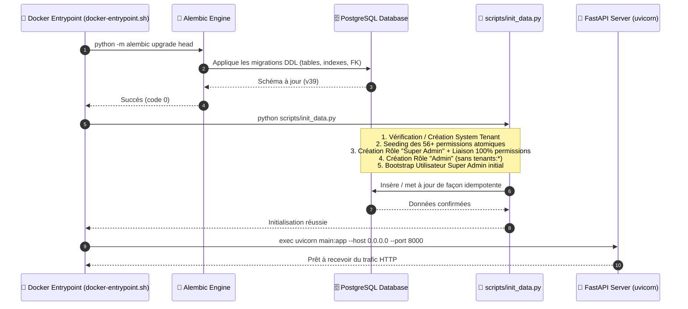
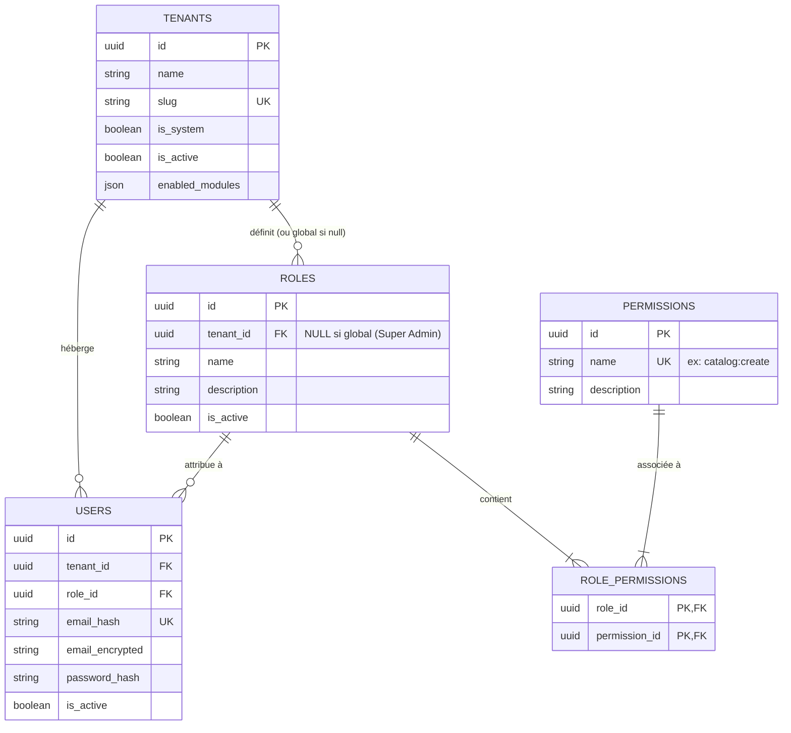

# 🔐 Guide d'Architecture : Système de Permissions (RBAC) & Stratégie d'Injection

> [!IMPORTANT]
> **Référence d'Ingénierie GeenkoDev** : Ce document détaille l'architecture du système de permissions (RBAC), son découplage structurel entre schéma de base de données et données initiales, ainsi que son cycle de contrôle de bout en bout (Backend FastAPI ➔ Edge Proxy Next.js ➔ Frontend React). Ce guide sert de support officiel pour le renforcement des capacités et l'harmonisation des standards de développement.

---

## 1. Synthèse Fondamentale : Alembic vs Script de Démarrage

Une question essentielle se pose dans tout projet d'envergure : **Comment les permissions sont-elles injectées en base de données ? Est-ce par migration Alembic ou par script de démarrage ?**

### 🎯 La Règle d'Or Appliquée dans notre Architecture :

```text
┌──────────────────────────────────────────────┐
│  Alembic (DDL) : STRUCTURE DES TABLES        │
│  ➜ Crée / altère les tables et contraintes    │
│  ➜ Zéro injection de données de permissions  │
└──────────────────────┬───────────────────────┘
                       │
                       ▼ APRÈS MIGRATIONS
┌──────────────────────────────────────────────┐
│  scripts/init_data.py (DML) : SEEDING DATA   │
│  ➜ Injecte les permissions atomiques          │
│  ➜ Crée les rôles de base et les liaisons    │
│  ➜ Idempotent et exécuté à chaque démarrage   │
└──────────────────────────────────────────────┘
```

| Dimension | Alembic (`alembic/versions/`) | Script de Démarrage (`scripts/init_data.py`) |
| :--- | :--- | :--- |
| **Nature de l'opération** | **DDL** (*Data Definition Language*) | **DML** (*Data Manipulation Language*) / Seeding |
| **Périmètre** | Tables `permissions`, `roles`, `role_permissions`, `users` | Lignes de permissions, rôles système, liaisons N:N, super admin |
| **Fréquence** | Lors de changements de schéma de tables | **À chaque démarrage du conteneur** via `docker-entrypoint.sh` |
| **Idempotence** | Linéaire (historique ordonné de révisions) | **Idempotent** (vérifie l'existence avant d'insérer, ne duplique rien) |

### 💡 Pourquoi ce choix d'ingénierie est supérieur :
1. **Évite la prolifération des fichiers de migration** : Ajouter une nouvelle permission dans le code (ex: `settings:export`) nécessite simplement une ligne dans `init_data.py`. S'il fallait créer une migration Alembic à chaque nouvelle fonctionnalité, le projet accumulerait des dizaines de migrations de pur contenu sans modification de schéma.
2. **Synchronisation automatique en déploiement (Coolify / Docker)** : Dès qu'un nouveau conteneur démarre avec du nouveau code, les nouvelles permissions sont instantanément insérées et associées aux rôles administratifs sans intervention humaine.
3. **Séparation nette des responsabilités** : L'outil d'infrastructure (Alembic) s'occupe de l'intégrité de la structure relationnelle ; la logique applicative (`init_data.py`) s'occupe de son état initial.

---

## 2. Cycle de Démarrage & Orchestration (`docker-entrypoint.sh`)

L'orchestration du démarrage dans le conteneur Docker garantit un ordre d'exécution strict et infaillible :



### Le script de démarrage réel (`docker-entrypoint.sh`) :
```bash
#!/bin/sh
set -e
cd /app

# Étape 1 : Migrations structurelles
if [ -f alembic.ini ]; then
  echo "[entrypoint] alembic upgrade head"
  python -m alembic upgrade head
fi

# Étape 2 : Données de référence et rôles initiaux
echo "[entrypoint] database initialization"
python scripts/init_data.py

# Étape 3 : Lancement du serveur API
exec "$@"
```

---

## 3. Modèle de Données Relationnel (RBAC Multi-Tenant)

Le système de permissions repose sur le patron standard **RBAC (*Role-Based Access Control*)**, adapté à une architecture multi-tenant :



### 🔍 Points clés du modèle (`models/models_user.py`) :
1. **Liaison Many-to-Many explicite (`RolePermissionLink`)** :
   ```python
   class RolePermissionLink(SQLModel, table=True):
       __tablename__ = "role_permissions"
       role_id: UUID = Field(foreign_key="roles.id", primary_key=True)
       permission_id: UUID = Field(foreign_key="permissions.id", primary_key=True)
   ```
2. **Isolation Multi-Tenant des Rôles** :
   - Un rôle peut être **global / système** (`tenant_id = NULL` ou lié au `system_tenant`), comme le rôle *Super Admin*.
   - Un rôle peut être **local au tenant** (`tenant_id = UUID_DU_TENANT`), permettant à chaque boutique de créer ses propres rôles personnalisés (ex: *Caissier*, *Gestionnaire de Stock*, *Comptable*).
3. **Permissions Globales Immuables** :
   - Les permissions (`permissions`) ne sont **jamais** liées à un tenant en particulier. Elles représentent l'ensemble universel des capacités techniques offertes par l'API.

---

## 4. Nomenclature & Découpage Granulaire des Permissions

Chaque permission respecte une convention de nommage stricte :
`[domaine]:[action]` ou `[domaine]:[sous-domaine]:[action]`

### Matrice des 4 Actions CRUD Canoniques :
- `:view` ➔ Lecture / consultation de la ressource ou accès à la page.
- `:create` ➔ Création d'une nouvelle ressource.
- `:update` ➔ Modification d'une ressource existante.
- `:delete` ➔ Suppression ou désactivation logique d'une ressource.

### Exemples par Domaines Métier :

| Domaine | Permissions associées | Usage / Protection |
| :--- | :--- | :--- |
| **Catalogue & Produits** | `catalog:view`, `catalog:create`, `catalog:update`, `catalog:delete` | Gestion des fiches articles et stocks |
| **Catégories & Marques** | `categories:*`, `brands:*`, `attributes:*` | Gestion des taxonomies et variantes |
| **Médiathèque** | `file-manager:view`, `file-manager:create`, `file-manager:delete` | Upload d'images produits et bannières |
| **Équipe & Sécurité** | `employees:*`, `roles:*` | Gestion des collaborateurs et des rôles |
| **Événements & Promos** | `events:*`, `promotions:*` | Campagnes marketing et remises |
| **CRM / Messages** | `contact-forms:*`, `contact-messages:*` | Formulaires publics et boîte de réception |
| **Rédaction / Blog** | `redactions:*`, `redactions-categories:*` | Articles de blog et contenu CMS |
| **Configuration** | `settings:view`, `settings:whatsapp:update`, `settings:delivery:update` | Paramètres généraux et intégrations |
| **Super Admin (Multi-Tenant)** | `tenants:view`, `tenants:create`, `tenants:update`, `tenants:delete` | Création et pilotage des boutiques clientes |

---

## 5. Fonctionnement Idempotent du Seeder (`scripts/init_data.py`)

L'idempotence signifie qu'exécuter le script 1 fois ou 1 000 fois produit exactement le même état stable, sans erreurs de clé unique ni doublons.

### Déroulement Pas-à-Pas du Seeder :

```python
# 1. Vérifie si la permission existe par son nom unique
perm = cruds_role.get_permission_by_name(db, name)
if not perm:
    perm = cruds_role.create_permission(db, name, desc)
    print(f"  + Permission created: {name}")

# 2. Vérifie et lie les permissions au rôle Super Admin
for name, perm in perm_objs.items():
    if not _role_has_permission(db, super_admin_role.id, perm.id):
        cruds_role.assign_permission_to_role(db, str(super_admin_role.id), str(perm.id))

# 3. Crée le rôle "Admin" standard pour les boutiques
# en lui accordant TOUT sauf la gestion des autres tenants ("tenants:*")
for name, perm in perm_objs.items():
    if not name.startswith("tenants:"):
        if not _role_has_permission(db, admin_role.id, perm.id):
            cruds_role.assign_permission_to_role(db, str(admin_role.id), str(perm.id))
```

---

## 6. Contrôle & Application de la Sécurité (Enforcement à 3 Niveaux)

La sécurité n'est pas confinée à une seule couche : elle est appliquée en **Défense en Profondeur** à trois niveaux complémentaires :

```mermaid
graph TD
    subgraph L3_Client [Niveau 3 : Frontend React]
        UI["Boutons, Menus, Tables (useCan.ts)"]
    end

    subgraph L2_Edge [Niveau 2 : Edge / Next.js Proxy]
        Proxy["proxy.ts (Vérification des routes et redirections)"]
    end

    subgraph L1_Backend [Niveau 1 : Backend FastAPI (Garantie Ultime)]
        API["PermissionChecker & ModuleChecker (api/dependencies.py)"]
    end

    L3_Client -->|1. Requête HTTP + Bearer Token| L2_Edge
    L2_Edge -->|2. Routage autorisé| L1_Backend
    L1_Backend -->|3. Vérification SQL des permissions| DB[(PostgreSQL)]
```

### Niveau 1 : Backend FastAPI (Sécurité Infaillible)
C'est le gardien ultime. Même si un utilisateur malveillant modifie le code JavaScript du navigateur, l'API rejette systématiquement les requêtes non autorisées avec un code `403 FORBIDDEN`.

Dans [`api/dependencies.py`](file:///f:/Coding/geenkodev/logic-branding/owned/kabowd-admin/apps/api/api/dependencies.py) :
```python
class PermissionChecker:
    def __init__(self, required_permission: str):
        self.required_permission = required_permission

    def __call__(self, current_employee: User = Depends(get_current_active_employee)):
        permissions: list[str] = []
        if current_employee.role:
            permissions = [p.name for p in current_employee.role.permissions]

        if self.required_permission not in permissions:
            raise HTTPException(
                status_code=status.HTTP_403_FORBIDDEN,
                detail=f"Permission manquante: {self.required_permission}",
            )
        return current_employee
```

Usage élégant et déclaratif sur une route d'API :
```python
@router.post("/items", dependencies=[Depends(PermissionChecker("catalog:create"))])
def create_item(...):
    # Ce code n'est exécuté QUE si l'utilisateur possède "catalog:create"
    ...
```

### Niveau 2 : Edge / Next.js Middleware (`proxy.ts`)
Intercepte la navigation avant même que la page ne se charge dans le navigateur :
- Appelle `/employees/me` pour récupérer le profil et le set de permissions.
- Redirige l'utilisateur vers son espace autorisé (ex: vers `/redactions` si l'utilisateur n'a pas accès au catalogue via `canAccessCatalogHome`).

### Niveau 3 : Interface Utilisateur React (`useCan.ts`)
Offre une expérience utilisateur propre et ergonomique :
- Masque les boutons d'ajout/modification/suppression si l'utilisateur n'a que la permission de lecture (`:view`).
- Masque les entrées de menu non pertinentes dans la barre latérale.

Exemple dans un composant React :
```tsx
const { can } = useCan();

return (
  <div>
    <h1>Catalogue Produits</h1>
    {can("catalog:create") && (
      <Button onClick={openCreateModal}>Ajouter un article</Button>
    )}
  </div>
);
```

---

## 7. Interaction Entre Modules Activés (`enabled_modules`) & Permissions

Un aspect architectural distinctif de notre système est la combinaison de **Feature-Flagging par Tenant** et de **Permissions Utilisateur** :

1. **Le Tenant souscrit à des modules** : `["catalog", "whatsapp", "redaction"]`
2. **L'utilisateur a un rôle avec des permissions** : `["catalog:create", "events:create", "whatsapp:update"]`
3. **Règle de filtrage** : Même si un rôle contient `events:create`, si le tenant n'a pas souscrit au module `events`, la permission est inactive et le menu n'apparaît pas.
4. **Exception Système** : Le tenant système (`Tenant.is_system == True`, Super Admin) contourne automatiquement les vérifications de modules (`isModuleEnabled` retourne toujours `true`).

Dans [`apps/admin/lib/permissions.ts`](file:///f:/Coding/geenkodev/logic-branding/owned/kabowd-admin/apps/admin/lib/permissions.ts) :
```typescript
export function filterPermissionsByTenantModules<T extends { name: string }>(
    permissions: T[],
    isSystemTenant: boolean,
    enabledModules: string[]
): T[] {
    if (isSystemTenant) return permissions;

    // Filtrer les permissions hors des modules activés pour ce tenant
    ...
}
```

---

## 8. Guide Pratique pour l'Équipe : Ajouter une Nouvelle Permission

Lorsqu'un développeur implémente une nouvelle fonctionnalité nécessitant une permission (ex: `invoices:export`) :

### Checklist Pas-à-Pas :
1. **Ajouter la permission dans `scripts/init_data.py`** :
   ```python
   permissions = [
       ...
       ("invoices:export", "Exporter les factures au format PDF / Excel"),
   ]
   ```
2. **Ajouter la constante dans `apps/admin/lib/permissions.ts`** :
   ```typescript
   export const PERMISSIONS = [
       ...
       "invoices:export",
   ] as const;
   ```
3. **Protéger le endpoint API dans FastAPI** :
   ```python
   @router.get("/invoices/export", dependencies=[Depends(PermissionChecker("invoices:export"))])
   def export_invoices(...):
       ...
   ```
4. **Conditionner l'UI dans React** :
   ```tsx
   {can("invoices:export") && <ExportButton onExport={handleExport} />}
   ```
5. **Relancer le conteneur ou exécuter `python scripts/init_data.py`** :
   - En local : `docker compose exec api python scripts/init_data.py`
   - En production : Automatique lors du déploiement via `docker-entrypoint.sh`.
   - **Aucune migration Alembic n'est nécessaire !**

---

## 9. Synthèse des Bonnes Pratiques & Anti-Patterns

### ✅ Ce qu'il faut faire :
- Toujours vérifier l'existence avant d'insérer (`get_permission_by_name`, `_role_has_permission`).
- Nommer systématiquement les permissions en minuscules avec des deux-points (`domaine:action`).
- Restreindre l'accès dès la définition de la route avec `dependencies=[Depends(PermissionChecker(...))]`.
- Toujours coupler la vérification de permission avec la vérification du `tenant_id` (`get_current_tenant_id`) pour éviter toute fuite de données inter-entreprises.

### ❌ Ce qu'il ne faut JAMAIS faire :
- **Ne jamais insérer de lignes de permissions dans une migration Alembic** (Alembic est réservé au DDL).
- **Ne jamais hardcoder d'identifiants UUID** pour les permissions (utiliser `Permission.name` comme clé de recherche immuable).
- **Ne jamais se contenter de masquer un bouton dans le Frontend** : un bouton masqué sans protection côté API est une faille de sécurité majeure.
