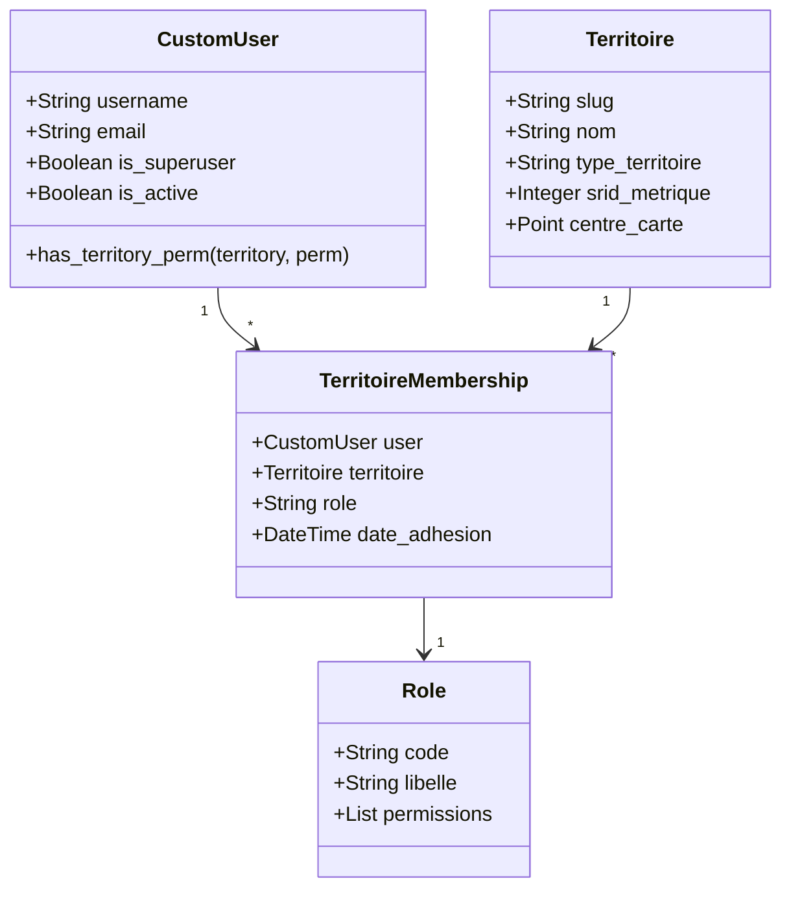

# 🌐 Vision Stratégique Long Terme : Modèle Open-Core & Multi-Territoires (« Un Lieu = Un Dossier »)

---

## 🧭 1. Manifeste & Positionnement

Le projet **GéoFoncier** a été initialement développé pour répondre aux besoins précis de deux sites pilotes au Sénégal : le **Campus de l'Université Alioune Diop de Bambey (UAD)** et la **Commune rurale de Ngogom**.

Cependant, ces deux implantations ne sont que des démonstrateurs d'un besoin universel : **permettre à toute collectivité, université, gestionnaire foncier ou parc d'activité de cartographier, valoriser et piloter son territoire grâce aux drones et au SIG**.

Pour démocratiser l'outil tout en garantissant sa pérennité industrielle et son modèle de financement, le projet adopte une double vision directrice :
1. **L'architecture modulaire « Un lieu = un dossier »** : Rendre la plateforme complètement agnostique du lieu, où chaque territoire est un espace autonome instanciable sans coder.
2. **Le modèle de distribution Open-Core** : S'inspirer directement des réussites open-source majeures telles que **Netdata**, **Chatwoot**, **Stalwart Mail** ou **Supabase**, en proposant une version communautaire libre auto-hébergeable et une offre Cloud / Entreprise complète managée.

---

## 📦 2. Le Modèle Open-Core : Community Edition vs Cloud / Enterprise

Le modèle Open-Core garantit que le cœur technologique reste libre, transparent et accessible à la communauté académique et aux petites communes, tout en offrant aux grandes organisations les fonctionnalités avancées d'échelle.

```text
┌────────────────────────────────────────────────────────────────────────────────────────┐
│                               ÉDITION CLOUD / ENTERPRISE                               │
│  • Multi-tenant managé (zéro infrastructure à gérer)                                   │
│  • RBAC étendu multi-organisations & SSO entreprise (SAML / OIDC / Google Workspace)  │
│  • Traitement photogrammétrique distribué sur GPU cloud managé                         │
│  • Stockage d'orthophotos objet S3 / Cloudflare R2 managé                              │
│  • Audit logs de conformité légale & traçabilité des modifications parcellaires        │
│  • Rapports d'urbanisme PDF officiels avec signature électronique                      │
│  • Support technique garanti et SLA haute disponibilité                                │
└───────────────────────────────────────────┬────────────────────────────────────────────┘
                                            │ repose sur
┌───────────────────────────────────────────▼────────────────────────────────────────────┐
│                         ÉDITION COMMUNAUTAIRE (OPEN-SOURCE)                            │
│  • Image Docker officielle prête à déployer (Coolify, Docker Compose, Portainer)       │
│  • Cœur complet GeoDjango + PostGIS + Leaflet                                          │
│  • Système de dossiers multi-territoires de base                                       │
│  • Inventaire foncier intégral (espaces, bâtiments, voiries, terrains, espaces verts)  │
│  • Chaîne photogrammétrique locale (connexion WebODM local, tuiles XYZ locales)        │
│  • Module citoyen de signalements géolocalisés de base                                 │
│  • Tableaux de bord synthétiques et graphiques Chart.js                                │
└────────────────────────────────────────────────────────────────────────────────────────┘
```

### Matrice Fonctionnelle Comparative :

| Fonctionnalité | Édition Communautaire (CE) | Édition Cloud / Entreprise |
|---|:---:|:---:|
| **Code source & Licence** | Open-source (Docker public libre) | Hybride (Services managés / Modules Entreprise) |
| **Nombre de territoires gérés** | Illimité (auto-hébergé) | Multi-organisations avec quotas ajustables |
| **Moteur SIG & Cartographie** | GeoDjango + PostGIS + Leaflet | GeoDjango + PostGIS + CDN tuiles haute vitesse |
| **Gestion foncière & Bâtiments** | ✅ Incluse | ✅ Incluse |
| **Aide à la décision (Constructions)**| ✅ Algorithme complet (Score / 100) | ✅ Scoring personnalisé + simulations 3D |
| **Photogrammétrie Drone** | WebODM local ou import GeoTIFF manuel | Cluster de traitement GPU cloud distribué |
| **Stockage des médias** | Volume disque local (`media/`) | Stockage objet illimité (S3 / R2) avec CDN |
| **Permissions utilisateurs** | Rôles prédéfinis par territoire | RBAC granulaire personnalisé + SSO/SAML |
| **Signalements citoyens** | ✅ Circuit standard à 4 étapes | ✅ Circuit personnalisable + intégration SMS/WhatsApp |
| **Audit Logs & Traçabilité** | Journal basique d'activité | Audit complet conforme RGPD / Cadastre officiel |

---

## 📁 3. Architecture Cible : « Un Lieu = Un Dossier »

### 3.1 Le Problème Actuel
Aujourd'hui, l'application possède deux applications Django cloisonnées :
* `foncier` : codé sur mesure pour le Campus UAD.
* `commune` : codé sur mesure pour la Commune de Ngogom.

Cette organisation crée de la duplication : les villages et maisons de Ngogom sont l'équivalent structurel des sous-espaces et bâtiments de l'UAD (Hiérarchie : **Limite englobante ➔ Zones intermédiaires ➔ Objets élémentaires**).

### 3.2 La Solution : Le Territoire comme Espace Dynamique
À terme, un nouveau lieu ne nécessite **aucune nouvelle application Django**. Il suffit de déposer un dossier structuré et d'exécuter une commande d'ingestion.

```text
territoires/
├── _modele/                       # Squelette modèle à dupliquer
│   ├── territoire.toml            # Fichier d'identité et de paramètres
│   └── README.md
├── uad-campus/                    # Dossier du Campus UAD
│   ├── territoire.toml
│   ├── limite.geojson             # Périmètre foncier de l'université
│   ├── couches/                   # Couches géographiques du site
│   │   ├── espaces.geojson
│   │   ├── batiments.geojson
│   │   ├── voiries.geojson
│   │   └── espaces_verts.geojson
│   └── orthophotos/sources.toml   # Références des orthophotos
└── ngogom/                        # Dossier de la Commune de Ngogom
    ├── territoire.toml
    ├── limite.geojson             # Limite administrative communale
    ├── couches/
    │   ├── villages.geojson
    │   ├── maisons.geojson
    │   └── pistes.geojson
    └── orthophotos/sources.toml
```

### 3.3 Spécification du fichier déclaratif `territoire.toml`
Rédigé en TOML (analysé nativement en Python ≥ 3.11 via `tomllib` sans dépendance externe) :

```toml
slug        = "commune-ngogom"
nom         = "Commune de Ngogom"
type        = "commune"            # "site" (campus, domaine) | "commune" | "agricole" | "parc"
pays        = "Sénégal"
region      = "Diourbel"
departement = "Bambey"

[carte]
centre        = [14.751, -16.524]  # [Latitude, Longitude] par défaut
zoom          = 15
srid_metrique = 32628              # Projection locale (UTM 28N ou 32629 pour l'est)

[codes]
prefixe_signalement = "NG"         # Génère NG-00001
prefixe_zone        = "V-"         # Villages V-001
prefixe_objet       = "M-"         # Maisons M-0001

[hierarchie]
label_limite = "Commune"
label_zone   = "Village"
label_objet  = "Maison / Parcelle"

[identite]
titre_application = "GéoFoncier Ngogom"
logo              = "identite/logo.jpg"
couleur_primaire  = "#0F766E"
```

---

## 👥 4. Gestion des Utilisateurs & Système de Permissions Granulaires (RBAC)

Pour permettre à plusieurs dizaines ou centaines d'utilisateurs d'interagir sur la plateforme sans interférence, le système de droits passe d'un profil statique global à un **RBAC scopé par territoire**.



### 4.1 Matrice des Rôles Scopés par Territoire

| Rôle | Portée (Scope) | Capacités |
|---|---|---|
| **Super Administrateur** | Instance globale | Accès technique total, création de nouveaux territoires, supervision globale. |
| **Administrateur de Territoire** | Un territoire donné | Gestion complète du dossier territorial, validation des membres, import de couches. |
| **Responsable Foncier** | Un territoire donné | Gestion du cadastre, validation/rejet des demandes de construction, suivi des travaux. |
| **Opérateur Drone / Géomaticien**| Un territoire donné | Création des missions de vol, import des orthophotos GeoTIFF, découpe des tuiles XYZ. |
| **Agent Technique / Voirie** | Un territoire donné | Prise en charge et résolution des signalements d'incidents (eau, route, électricité). |
| **Observateur / Auditeur** | Un territoire donné | Consultation en lecture seule des cartes, statistiques et tableaux de bord fonciers. |
| **Citoyen / Public** | Un territoire donné | Consultation de la carte publique, dépôt et suivi de ses propres signalements. |

### 4.2 Principe d'Isolation Contextuelle
* Un utilisateur naviguant sur l'application a un **territoire actif** (déterminé par l'URL `/t/<slug>/...` ou la session).
* Les requêtes de base de données filtrent automatiquement par ce contexte (`Model.objects.filter(territoire=request.territoire)`).
* Un maire de Ngogom ne peut en aucun cas altérer les parcelles de l'Université de Bambey ou d'une commune voisine.

---

## 🗺️ 5. Feuille de Route d'Implémentation Progressive

La transformation vers ce modèle s'opère par étapes autonomes, garantissant l'intégrité de l'application à chaque livraison :

```text
Étape 0 (Centralisation)
  └── Regrouper les constantes hardcodées dans un module unique sans casser l'existant.
Étape 1 (Structure Dossiers)
  └── Créer le dossier territoires/ avec squelette _modele/ et les données de l'UAD et Ngogom.
Étape 2 (Modèle Territoire & Membership)
  └── Créer une application Django core/territoires avec modèle Territoire et TerritoireMembership.
Étape 3 (Commande d'ingestion)
  └── Développer manage.py charger_territoire qui orchestre l'import complet d'un dossier.
Étape 4 (Middleware de Contexte Actif)
  └── Injecter request.territoire dans les vues, adapter la carte Leaflet et le calcul métrique.
Étape 5 (Harmonisation des Couches)
  └── Faire converger la hiérarchie spatiale (Campus/Espace/Batiment et Commune/Village/Maison).
```

---

## 🎯 6. Critère de Succès Ultime

> **Le Test du Nouveau Territoire :**
> Un nouveau géomaticien ou technicien municipal télécharge l'image Docker communautaire, duplique `territoires/_modele/` vers `territoires/ma-commune/`, y renseigne son fichier `territoire.toml` et ses fichiers GeoJSON, lance :
> ```bash
> docker exec -it geofoncier-app python app/manage.py charger_territoire territoires/ma-commune
> ```
> et accède instantanément à sa commune entièrement cartographiée et opérationnelle **sans avoir modifié un seul fichier de code Python ou HTML**.
